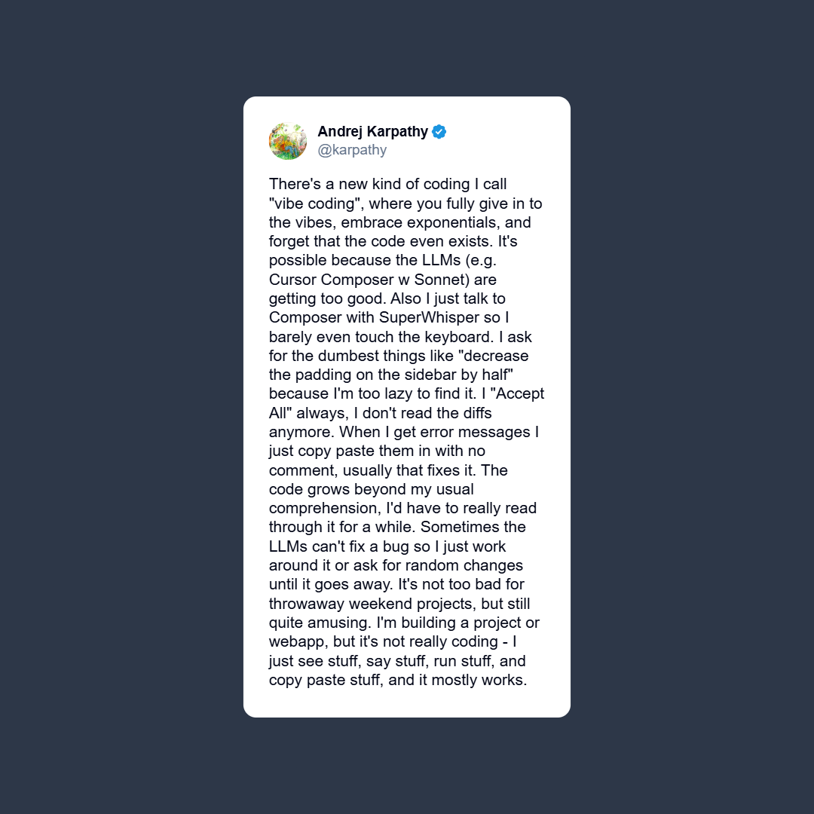
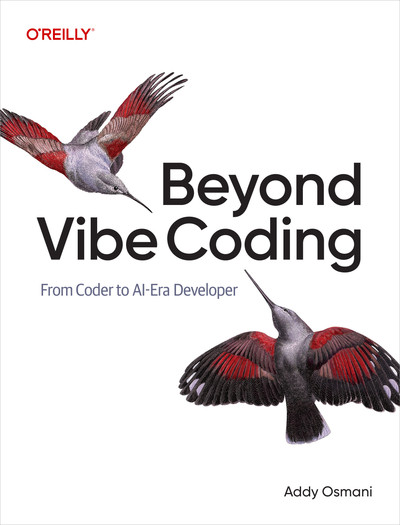

# 🚀 Nerdearla 2025 - Vibe Test Driven Development

[Ver en la agenda de Nerdear.la](https://nerdear.la/agenda/vibe-test-driven-development/)

# 📚 Recursos de la charla

## 🤖 Prompt para la Pit-IA

```
Quiero que hagas un simulador de números romanos en un lenguaje de programación.

Arrancá con el caso más sencillo (por ejemplo, 1).

Escribí un test lo más simple posible que falle y
luego corregí el código con la implementación más simple que haga pasar ese test.

No hagas suposiciones prematuras.

Solo generaliza cuando tengas 2 o 3 casos consecutivos validados y encuentres un patrón.

Cada generalización debe basarse en evidencia y no puede romper ningún test existente. 

Repetí este proceso iterativamente, agregando bloques de números,
 hasta cubrir todos los números hasta el 73. 

Quiero ver la evolución completa del algoritmo y de los tests, sin interrupciones ni confirmaciones.
```

[Conversación con ChatGPT](https://chatgpt.com/share/68d15168-9d08-800e-ab8d-9fe0a1319757)

<div align="center">
  
</div>

## 💻 Vibe Coding

[](https://x.com/karpathy/status/1886192184808149383)

## 🎤 Charlas Previas

<div style="display: grid; grid-template-columns: repeat(auto-fill, minmax(300px, 1fr)); gap: 20px; margin: 20px 0;">
  <a href="https://www.youtube.com/watch?v=MVXewf_W6sk" target="_blank" rel="noopener noreferrer" style="text-decoration: none; color: inherit;">
    <div style="text-align: center;">
      
      <p style="margin: 8px 0 0; font-weight: 500;">Test Driven Development 101</p>
    </div>
  </a>
  
  <a href="https://www.youtube.com/watch?v=hjey2N1IpwE" target="_blank" rel="noopener noreferrer" style="text-decoration: none; color: inherit;">
    <div style="text-align: center;">
      
      <p style="margin: 8px 0 0; font-weight: 500;">Wordle con TDD e IA</p>
    </div>
  </a>
  
  <a href="https://www.youtube.com/watch?v=A0ZjnGN8DIs" target="_blank" rel="noopener noreferrer" style="text-decoration: none; color: inherit;">
    <div style="text-align: center;">
      
      <p style="margin: 8px 0 0; font-weight: 500;">Una Regla para Gobernarlos a Todos</p>
    </div>
  </a>
  
  <a href="https://www.youtube.com/watch?v=0cc9faVOx9M" target="_blank" rel="noopener noreferrer" style="text-decoration: none; color: inherit;">
    <div style="text-align: center;">
      
      <p style="margin: 8px 0 0; font-weight: 500;">TDD en Sistemas Heredados</p>
    </div>
  </a>
  
  <a href="https://www.youtube.com/watch?v=e36FSN620zU" target="_blank" rel="noopener noreferrer" style="text-decoration: none; color: inherit;">
    <div style="text-align: center;">
      
      <p style="margin: 8px 0 0; font-weight: 500;">Centauro del Código Limpio</p>
    </div>
  </a>
</div>

## 💾 Repositorio para practicar TDD

Original:

[https://github.com/yetidevworks/yetisearch](https://github.com/yetidevworks/yetisearch)

Tiene base de tests, hace búsquedas SQL y cero dependencias.

Fork: [https://github.com/mcsee/yetisearch](https://github.com/mcsee/yetisearch)

📊 Estudios de productividad

[Testing Effect](https://en.wikipedia.org/wiki/Testing_effect)

[Estudio de Arxive](https://arxiv.org/abs/2506.08872)

[Reporte DORA](https://dora.dev/research/ai/gen-ai-report/)

[Estudio en Microsoft + Accenture + Empresa anónima (2024)](https://medium.com/@sahin.samia/can-ai-really-boost-developer-productivity-new-study-reveals-a-26-increase-1f34e70b5341) 

[METR (Model Evaluation and Threat Research)](https://fortune.com/2025/07/20/ai-hampers-productivity-software-developers-productivity-study/)

[Estudio de Stanford (2025)](https://www.youtube.com/watch?v=tbDDYKRFjhk)

# 📖 Bibliografía

<div style="display: flex; justify-content: space-around; flex-wrap: wrap;">
  <a href="https://amzn.to/3VyRwlH"></a>
  <a href="https://www.amazon.com/-/es/Modern-Software-Engineering-Better-Faster/dp/0137314914"></a>
  <a href="https://amzn.to/48xgqK4"></a>
  <a href="https://amzn.to/46y3Sj2"></a>
</div>

# 📞 Contacto

<p>
  <a href="https://maximilianocontieri.com/"></a>
  <a href="https://substack.com/@maxicontieri"></a>
  <a href="https://www.linkedin.com/in/mcsee/"></a>
  <a href="https://x.com/mcsee1"></a>
  <a href="https://bsky.app/profile/maximilianocontieri.com"></a>
</p>
